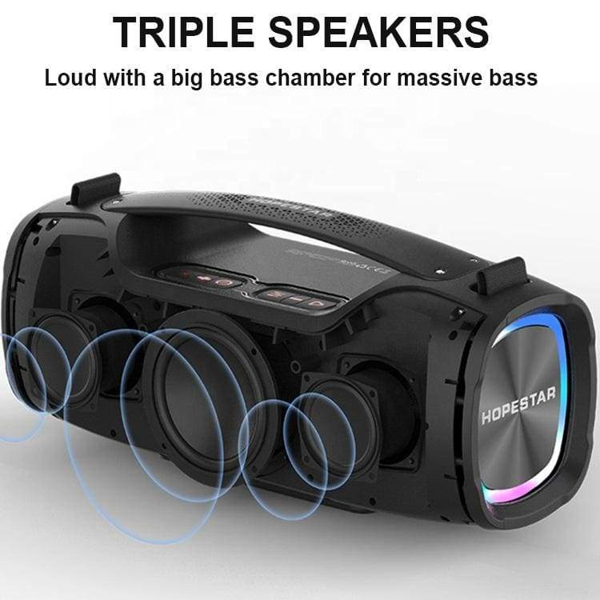
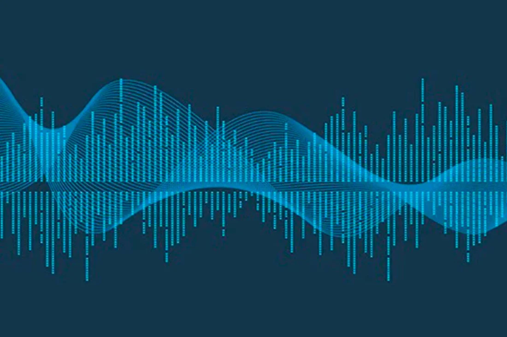

# Ruhe0118_9103_tut4_G3

## Wheel of Fortune
### Interaction:

This page will be loaded as shown as the groupwork base. To start, double click anywhere in the canvas, then the music will start to play.If you want to stop or restart, click once at anywhere in the canvas. 
When the music is playing, slowly move the mouse around the canvas, the volume will change up and down with the mouse. Meanwhile the sound stereo will also change following the x-axis of the mouse.

### Individual animate and inspiration:

Using approach: Audio
Animated Properties : The center circles of the major wheels are changing colors and sizes. Add new ripples in the gap of the wheels. The core thing I have modified is the small elements in the main wheels. 
The center circles were inspired by the bass of the speakers when music is playing such as vibrating with music beats and bass. 

[image of bass](https://noco.co.nz/products/hopestar-a6x-55w-big-bluetooth-speaker-big-bass-triple-speakers-6000mah-battery-tws-powerbank)

The second inspiration was generated from sound waves and the week 11 tutorial part 2. This aims to create surrounding sounds waves from left to right or right to left. The sound can also be controlled though mouse up for volume up and mouse down for volume down. 

[image of sound waves] (https://syos.co/en/blogs/news/what-is-a-sound-a-general-reminder-on-sound-waves)

The third function ‘ripple’ was inspired by the water dripping image that created ripple waves. Gravity wave deep space has also inspired me to use the ripple function to create effects and more interactive and seamless experience when the audio and the effects on fortune wheels.

[image of water ripple wave] (https://savvy.directorprep.com/blog/the-ripple-effect)

[image of gravity wave deep space] (https://www.popularmechanics.com/space/deep-space/a43431702/how-well-see-missing-ripples-in-spacetime/)

### Techniques
The individual technique used in creating the fortune wheel artwork focuses on changing sizes and colors of the circle components using volume level analyzer and HSB color random mode. Then the music interaction is made by mouse move and pan analysis. The last technique focused on creating ripples with opacity is done by FFT analysis and the ripple drawing function. All these techniques mentioned above have allowed me to bring my imagination effectively and seamlessly to life via P5js. 
